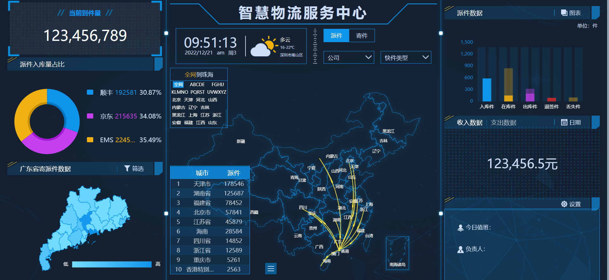
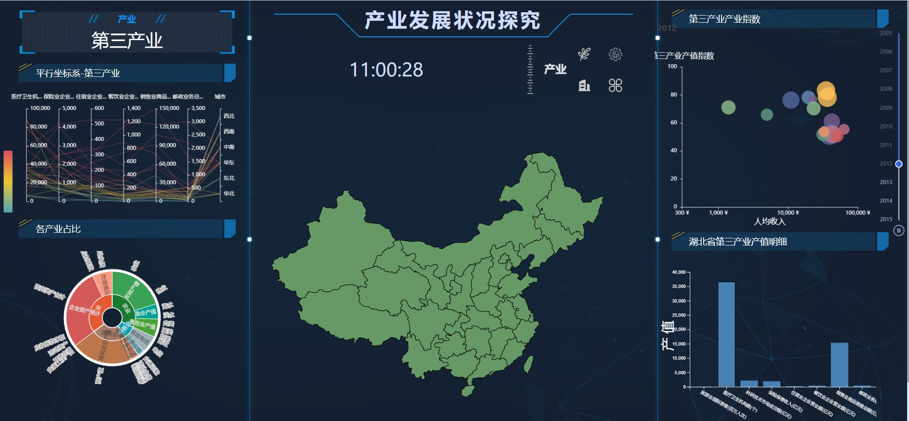

# Interactivate Dashboard（可视化交互大屏）

**Development of China's four major industries in recent 10 years.**

[**Web preview**](https://liuchao6355.github.io/Interactive_Dashboard/).（将页面缩放至75%并刷新网页后样式显示正常）

# 参考模板：[智慧物流](https://github.com/zhangti0708/bigdata-examples/tree/master/%E6%99%BA%E6%85%A7%E7%89%A9%E6%B5%81/%E6%99%BA%E6%85%A7%E7%89%A9%E6%B5%81)

  
仅使用了该模板的**css样式**，我们的项目使用echarts和d3绘图，采用国家统计局自行下载的数据，并实现了不同于原模板的交互效果（多图交互，地图点击事件等），在数据和可视化实现方面均与原模板截然不同。

Requirements
----

- HTML 
- CSS 
- JavaScript 
- Echarts
- d3

1. Click the industry button to change to a different industry

2. Click the provinces on the map to view the output value of each industry in different provinces

Data Source: [国家统计局数据](https://data.stats.gov.cn/easyquery.htm?cn=E0103).
